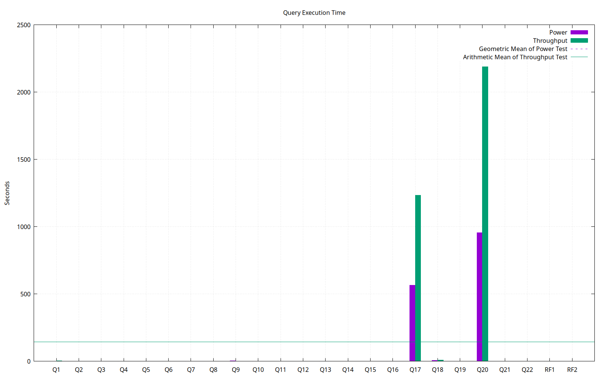

======================
Database Test 3 Report
======================

**These results are not comparable to TPC Benchmark(TM) H Results.**

Summary
=======

* Date:  Fri Mar 28 13:50:13 CET 2025
* Database Size: 1 GB
* Database Manager: PostgreSQL 17.2
* Operating System: 6.13.8-arch1-1
* Notes: 

Metrics
=======

=======================  ===========  ==
        Composite Score       327.04
 Load Test Time (hours)         0.01  
       Power Test Score      2379.89  
  Throughput Test Score        44.94  
=======================  ===========  ==

Query Times
===========

Power Test
----------

* Seed: 328122537

+--------------------+------------------------+------------------------+------------------------+
| Duration (seconds) |    Query Start Time    |     RF1 Start Time     |     RF2 Start Time     |
|                    +------------------------+------------------------+------------------------+
|                    |     Query End Time     |      RF1 End Time      |      RF2 End Time      |
+====================+========================+========================+========================+
|            1550.38 | 2025-03-28 11:25:40.76 | 2025-03-28 11:25:38.50 | 2025-03-28 11:51:28.79 |
|                    +------------------------+------------------------+------------------------+
|                    | 2025-03-28 11:51:28.77 | 2025-03-28 11:25:40.74 | 2025-03-28 11:51:28.86 |
+--------------------+------------------------+------------------------+------------------------+

=======  =========================  ==
 Query    Response Time (seconds)
=======  =========================  ==
      1                       2.41  `Plan <power/plans/1.txt>`__ | `Result <power/results/1.txt>`__
      2                       0.80  `Plan <power/plans/2.txt>`__ | `Result <power/results/2.txt>`__
      3                       0.73  `Plan <power/plans/3.txt>`__ | `Result <power/results/3.txt>`__
      4                       0.38  `Plan <power/plans/4.txt>`__ | `Result <power/results/4.txt>`__
      5                       0.87  `Plan <power/plans/5.txt>`__ | `Result <power/results/5.txt>`__
      6                       0.62  `Plan <power/plans/6.txt>`__ | `Result <power/results/6.txt>`__
      7                       1.15  `Plan <power/plans/7.txt>`__ | `Result <power/results/7.txt>`__
      8                       1.24  `Plan <power/plans/8.txt>`__ | `Result <power/results/8.txt>`__
      9                       2.95  `Plan <power/plans/9.txt>`__ | `Result <power/results/9.txt>`__
     10                       1.07  `Plan <power/plans/10.txt>`__ | `Result <power/results/10.txt>`__
     11                       0.48  `Plan <power/plans/11.txt>`__ | `Result <power/results/11.txt>`__
     12                       0.92  `Plan <power/plans/12.txt>`__ | `Result <power/results/12.txt>`__
     13                       0.26  `Plan <power/plans/13.txt>`__ | `Result <power/results/13.txt>`__
     14                       0.77  `Plan <power/plans/14.txt>`__ | `Result <power/results/14.txt>`__
     15                       1.57  `Plan <power/plans/15.txt>`__ | `Result <power/results/15.txt>`__
     16                       0.94  `Plan <power/plans/16.txt>`__ | `Result <power/results/16.txt>`__
     17                     564.94  `Plan <power/plans/17.txt>`__ | `Result <power/results/17.txt>`__
     18                       6.21  `Plan <power/plans/18.txt>`__ | `Result <power/results/18.txt>`__
     19                       1.79  `Plan <power/plans/19.txt>`__ | `Result <power/results/19.txt>`__
     20                     956.46  `Plan <power/plans/20.txt>`__ | `Result <power/results/20.txt>`__
     21                       0.92  `Plan <power/plans/21.txt>`__ | `Result <power/results/21.txt>`__
     22                       0.14  `Plan <power/plans/22.txt>`__ | `Result <power/results/22.txt>`__
    RF1                       2.24  `Result <power/results/rf1.txt>`__
    RF2                       0.07  `Result <power/results/rf2.txt>`__
=======  =========================  ==

Throughput Test
---------------

Stream execution summary:

+-----------+-----------+------------------------+------------------------+------------------------+
|  Stream   | Duration  |    Query Start Time    |     RF1 Start Time     |     RF2 Start Time     |
+-----------+ (seconds) +------------------------+------------------------+------------------------+
|   Seed    |           |     Query End Time     |      RF1 End Time      |      RF2 End Time      |
+===========+===========+========================+========================+========================+
|         1 |   3523.58 | 2025-03-28 11:51:29.82 | 2025-03-28 11:51:28.91 | 2025-03-28 11:51:31.53 |
+-----------+           +------------------------+------------------------+------------------------+
| 328122538 |           | 2025-03-28 12:50:13.36 | 2025-03-28 11:51:31.51 | 2025-03-28 11:51:31.68 |
+-----------+-----------+------------------------+------------------------+------------------------+
|         2 |   3394.23 | 2025-03-28 11:51:29.84 | 2025-03-28 11:51:31.75 | 2025-03-28 11:51:34.31 |
+-----------+           +------------------------+------------------------+------------------------+
| 328122539 |           | 2025-03-28 12:48:04.02 | 2025-03-28 11:51:34.27 | 2025-03-28 11:51:34.51 |
+-----------+-----------+------------------------+------------------------+------------------------+

Query execution duration (seconds) (Click **P** for plans and **R** for results):

========  ================================================================================  ================================================================================  ================================================================================  ================================================================================  ================================================================================  ================================================================================  ================================================================================
 Stream      Q1                                                                                Q2                                                                                Q3                                                                                Q4                                                                                Q5                                                                                Q6                                                                                Q7                                                                           
========  ================================================================================  ================================================================================  ================================================================================  ================================================================================  ================================================================================  ================================================================================  ================================================================================
       1      2.90   `P <throughput/plans/1/1.txt>`__   `R <throughput/results/1/1.txt>`__      0.50   `P <throughput/plans/1/2.txt>`__   `R <throughput/results/1/2.txt>`__      1.18   `P <throughput/plans/1/3.txt>`__   `R <throughput/results/1/3.txt>`__      0.23   `P <throughput/plans/1/4.txt>`__   `R <throughput/results/1/4.txt>`__      1.72   `P <throughput/plans/1/5.txt>`__   `R <throughput/results/1/5.txt>`__      1.12   `P <throughput/plans/1/6.txt>`__   `R <throughput/results/1/6.txt>`__      1.73   `P <throughput/plans/1/7.txt>`__   `R <throughput/results/1/7.txt>`__
       2      3.73   `P <throughput/plans/2/1.txt>`__   `R <throughput/results/2/1.txt>`__      0.90   `P <throughput/plans/2/2.txt>`__   `R <throughput/results/2/2.txt>`__      1.35   `P <throughput/plans/2/3.txt>`__   `R <throughput/results/2/3.txt>`__      0.47   `P <throughput/plans/2/4.txt>`__   `R <throughput/results/2/4.txt>`__      1.80   `P <throughput/plans/2/5.txt>`__   `R <throughput/results/2/5.txt>`__      1.46   `P <throughput/plans/2/6.txt>`__   `R <throughput/results/2/6.txt>`__      2.08   `P <throughput/plans/2/7.txt>`__   `R <throughput/results/2/7.txt>`__
     Min                                                                              2.90                                                                              0.50                                                                              1.18                                                                              0.23                                                                              1.72                                                                              1.12                                                                              1.73
     Max                                                                              3.73                                                                              0.90                                                                              1.35                                                                              0.47                                                                              1.80                                                                              1.46                                                                              2.08
     Avg                                                                              3.31                                                                              0.70                                                                              1.26                                                                              0.35                                                                              1.76                                                                              1.29                                                                              1.91
========  ================================================================================  ================================================================================  ================================================================================  ================================================================================  ================================================================================  ================================================================================  ================================================================================

========  ================================================================================  ================================================================================  ================================================================================  ================================================================================  ================================================================================  ================================================================================  ================================================================================
 Stream      Q8                                                                                Q9                                                                                Q10                                                                               Q11                                                                               Q12                                                                               Q13                                                                               Q14                                                                          
========  ================================================================================  ================================================================================  ================================================================================  ================================================================================  ================================================================================  ================================================================================  ================================================================================
       1      1.22   `P <throughput/plans/1/8.txt>`__   `R <throughput/results/1/8.txt>`__      1.90   `P <throughput/plans/1/9.txt>`__   `R <throughput/results/1/9.txt>`__      1.23  `P <throughput/plans/1/10.txt>`__  `R <throughput/results/1/10.txt>`__      1.44  `P <throughput/plans/1/11.txt>`__  `R <throughput/results/1/11.txt>`__      1.31  `P <throughput/plans/1/12.txt>`__  `R <throughput/results/1/12.txt>`__      0.31  `P <throughput/plans/1/13.txt>`__  `R <throughput/results/1/13.txt>`__      1.26  `P <throughput/plans/1/14.txt>`__  `R <throughput/results/1/14.txt>`__
       2      2.31   `P <throughput/plans/2/8.txt>`__   `R <throughput/results/2/8.txt>`__      3.06   `P <throughput/plans/2/9.txt>`__   `R <throughput/results/2/9.txt>`__      2.00  `P <throughput/plans/2/10.txt>`__  `R <throughput/results/2/10.txt>`__      1.26  `P <throughput/plans/2/11.txt>`__  `R <throughput/results/2/11.txt>`__      1.35  `P <throughput/plans/2/12.txt>`__  `R <throughput/results/2/12.txt>`__      0.76  `P <throughput/plans/2/13.txt>`__  `R <throughput/results/2/13.txt>`__      1.30  `P <throughput/plans/2/14.txt>`__  `R <throughput/results/2/14.txt>`__
     Min                                                                              1.22                                                                              1.90                                                                              1.23                                                                              1.26                                                                              1.31                                                                              0.31                                                                              1.26
     Max                                                                              2.31                                                                              3.06                                                                              2.00                                                                              1.44                                                                              1.35                                                                              0.76                                                                              1.30
     Avg                                                                              1.77                                                                              2.48                                                                              1.62                                                                              1.35                                                                              1.33                                                                              0.53                                                                              1.28
========  ================================================================================  ================================================================================  ================================================================================  ================================================================================  ================================================================================  ================================================================================  ================================================================================

========  ================================================================================  ================================================================================  ================================================================================  ================================================================================  ================================================================================  ================================================================================  ================================================================================
 Stream      Q15                                                                               Q16                                                                               Q17                                                                               Q18                                                                               Q19                                                                               Q20                                                                               Q21                                                                          
========  ================================================================================  ================================================================================  ================================================================================  ================================================================================  ================================================================================  ================================================================================  ================================================================================
       1      2.34  `P <throughput/plans/1/15.txt>`__  `R <throughput/results/1/15.txt>`__      0.42  `P <throughput/plans/1/16.txt>`__  `R <throughput/results/1/16.txt>`__   1156.78  `P <throughput/plans/1/17.txt>`__  `R <throughput/results/1/17.txt>`__      9.10  `P <throughput/plans/1/18.txt>`__  `R <throughput/results/1/18.txt>`__      1.14  `P <throughput/plans/1/19.txt>`__  `R <throughput/results/1/19.txt>`__   2332.60  `P <throughput/plans/1/20.txt>`__  `R <throughput/results/1/20.txt>`__      2.53  `P <throughput/plans/1/21.txt>`__  `R <throughput/results/1/21.txt>`__
       2      2.10  `P <throughput/plans/2/15.txt>`__  `R <throughput/results/2/15.txt>`__      0.53  `P <throughput/plans/2/16.txt>`__  `R <throughput/results/2/16.txt>`__   1311.44  `P <throughput/plans/2/17.txt>`__  `R <throughput/results/2/17.txt>`__      8.78  `P <throughput/plans/2/18.txt>`__  `R <throughput/results/2/18.txt>`__      1.45  `P <throughput/plans/2/19.txt>`__  `R <throughput/results/2/19.txt>`__   2043.18  `P <throughput/plans/2/20.txt>`__  `R <throughput/results/2/20.txt>`__      2.05  `P <throughput/plans/2/21.txt>`__  `R <throughput/results/2/21.txt>`__
     Min                                                                              2.10                                                                              0.42                                                                           1156.78                                                                              8.78                                                                              1.14                                                                           2043.18                                                                              2.05
     Max                                                                              2.34                                                                              0.53                                                                           1311.44                                                                              9.10                                                                              1.45                                                                           2332.60                                                                              2.53
     Avg                                                                              2.22                                                                              0.47                                                                           1234.11                                                                              8.94                                                                              1.30                                                                           2187.89                                                                              2.29
========  ================================================================================  ================================================================================  ================================================================================  ================================================================================  ================================================================================  ================================================================================  ================================================================================

========  ================================================================================  ================================================================================  ================================================================================
 Stream      Q22                                                                               RF1                                                                               RF2                                                                          
========  ================================================================================  ================================================================================  ================================================================================
       1      0.09  `P <throughput/plans/1/22.txt>`__  `R <throughput/results/1/22.txt>`__      2.60   `P <throughput/plans/1/1.txt>`__   `R <throughput/results/1/1.txt>`__      0.14   `P <throughput/plans/1/2.txt>`__   `R <throughput/results/1/2.txt>`__
       2      0.18  `P <throughput/plans/2/22.txt>`__  `R <throughput/results/2/22.txt>`__      2.51   `P <throughput/plans/2/1.txt>`__   `R <throughput/results/2/1.txt>`__      0.20   `P <throughput/plans/2/2.txt>`__   `R <throughput/results/2/2.txt>`__
     Min                                                                              0.09                                                                              2.51                                                                              0.14
     Max                                                                              0.18                                                                              2.60                                                                              0.20
     Avg                                                                              0.13                                                                              2.55                                                                              0.17
========  ================================================================================  ================================================================================  ================================================================================

PostgreSQL Report
=================
